# Tool-Call 电路挖掘最终报告（只看本目录即可）

## 1. 任务与实验设置
- 目标：解释 Qwen3-1.7B 为何在 clean 下输出 `<tool_call>`，在 corrupt 下不输出。
- 数据：`q1~q164` clean/corrupt 成对样本。
- 有效样本：按 `gap > 0.5` 过滤后，后续因果分析使用 `139` 条。
- 模型：`/root/data/Qwen/Qwen3-1.7B`

## 2. 统一目标函数与指标（后文都用这个）

```text
obj(x) = logit_x("<tool_call>") - logit_x(distractor)
gap    = obj(clean) - obj(corrupt)

sufficiency = (obj(corrupt + clean_patch) - obj(corrupt)) / gap
necessity   = (obj(clean) - obj(clean + corrupt_patch)) / gap
```

- `distractor` 为 corrupt 下最后 token 的贪心预测（若等于 `<tool_call>` 则用 top-2）。
- `sufficiency` 越接近 1，说明该电路足以恢复 clean/corrupt 差异。
- `necessity` 越接近 1，说明破坏该电路会明显损坏 clean 行为。
- 指标可能 `>1`（非线性叠加放大）或 `<0`（方向相反）。

## 3. 方法流程（每一步后直接给图和结果）

### 3.1 单样本 ACDC-style 电路挖掘
**怎么做**
1. 对每个样本跑 clean/corrupt，得到 `clean_obj`、`corrupt_obj`、`gap`。
2. 节点打分：
- Head CT：单头 clean->corrupt patch 的因果提升。
- Head AP：`grad * (clean_z - corrupt_z)`。
- MLP gain：单层 MLP clean->corrupt patch 的因果提升。
3. 选点：
- 头分数 `0.55*CT + 0.45*AP`。
- 分层分桶 `[0-6],[7-13],[14-20],[21-27]`，优先阈值内高分节点（头阈值优先 `>0.15`，MLP 优先 `>0.10`）。
4. 建边：
- `Input -> 早层锚点`，中间每节点最多 `2` 个父节点，晚层连到 `Output`。
- 自动修复连通性和出度，保证除 Output 外每节点有出度。
5. 对该样本电路计算 suff/nec。

**这一步产出**
- 每个样本都会有一个详细图 + 粗图 + summary（已用于后续聚合）。
- 164 条样本里，有效进入跨样本因果统计的为 `139` 条（`gap>0.5`）。

### 3.2 跨样本聚合（164 -> 全局 core）
**怎么做**
1. 给每个样本一个质量权重：

```text
w_i = 1[gap_i>0.5] * clip(det_i,0,1) * clip(nec_i,0,1) * ap_discount_i
```

2. 计算加权支持度：
- `support(node) = Σ w_i * I(node in sample_i) / Σ w_i`
- 边同理。
3. 设阈值抽取共识 core：
- core: `node>=0.50`, `edge>=0.35`
- relaxed: `node>=0.25`, `edge>=0.15`
4. 图修复：保证 Input 可达、Output 可达、非 Output 节点有出度。
5. replay：全局 core 对比同规模随机节点集。

**图与结果**


- 全样本：`164`
- 全局 core：`10` 节点、`23` 边
- replay（有效 139 样本）：
- `global_suff_ratio_median = 0.907`
- `global_nec_ratio_median = 0.924`
- 随机同规模 `suff_median = 0.328`
- `global-random` 中位差 `0.583`

结论：跨样本共识电路明显优于随机对照。

### 3.3 节点语义角色分析（读什么/写什么）
**怎么做**
1. 定义位置集合：`contrast`、`tool_call_tags`、`tools_block`、`user_block`、`top1/top3`。
2. 对每个 head 做“子集路径 patch”：只保留来自某位置集合的读入贡献，计算恢复比。
3. 对每个节点记录写侧：`delta logit(<tool_call>)`、`delta logit(distractor)`。
4. 按规则把每个节点映射到语义角色，并在 139 样本上聚合稳定性后确定核心角色。

**角色判定依据（明确规则，不是主观命名）**
- Head 读侧角色：
- 若满足 `tool_call_tags_ratio_median >= 0.15` 且 `attn_tool_call_tags_clean_mean >= 0.08`，或 top1 常读到 `<tool_call>`，判为 `Tool-Tag Reader`。
- 否则若 `user_block_ratio_median >= 0.15`，判为 `Query Reader`。
- 否则若 `tools_block_ratio_median >= 0.12`，判为 `Schema Reader`。
- 否则若 `contrast_ratio_median >= 0.05` 或 `attn_contrast_clean_mean >= 0.01`，判为 `Instruction Gate`。
- 其他默认归为 `Format Router`。
- Head 写侧角色：
- 若 `distractor_logit_delta_median <= -1.0`，打 `Distractor Suppressor` 标签。
- 若 `target_logit_delta_median >= 0.8`，打 `Target Booster` 标签。
- 两者都满足则合并为 `Target+Suppressor`。
- MLP 角色：
- `full_ratio_median >= 0.30` 且 `target_logit_delta_median >= 0.8` -> `Primary Writer MLP`。
- `full_ratio_median >= 0.18` 且 `distractor_logit_delta_median <= -0.8` -> `Support Suppressor MLP`。
- `full_ratio_median >= 0.18` -> `Support Writer MLP`。
- `full_ratio_median >= 0.05` -> `Aux MLP`；否则 `Weak MLP`。

**核心角色如何最终确定**
- 不是看单样本，而是看 139 样本的中位指标是否稳定满足上述规则。
- 同时检查读侧与写侧是否一致指向同一语义（例如某头既稳定读 tool tags，又稳定压低 distractor）。
- 只有“规则满足 + 跨样本稳定”的节点才进入最终核心角色表。

**图与结果**

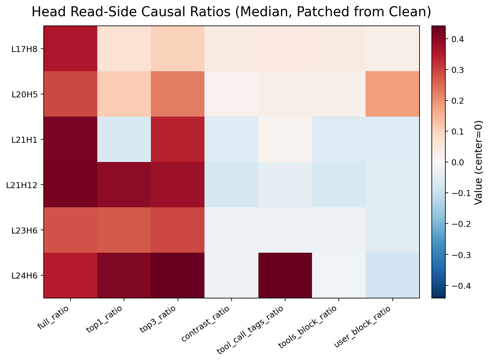

- 横轴是 7 个 `read-side causal ratio` 指标（每列都是“恢复比”）。
- `full_ratio`：该头保留全部位置读入贡献时的恢复比，等价于该头完整 clean->corrupt patch 的读侧效果。
- `top1_ratio`：只保留该头在 clean 下最后 query 最关注的第 1 个位置（attention top-1）时的恢复比。
- `top3_ratio`：只保留 attention top-3 位置时的恢复比。
- `contrast_ratio`：只保留 clean/corrupt 差异 token 位置（本数据固定在 pos=133）时的恢复比。
- `tool_call_tags_ratio`：只保留 `<tool_call>` 与 `</tool_call>` 位置集合时的恢复比。
- `tools_block_ratio`：只保留 `<tools>...</tools>` 区间位置时的恢复比。
- `user_block_ratio`：只保留最后 user 段位置时的恢复比。
- 每一列都按同一公式归一化：`(obj(patched_subset)-obj(corrupt))/gap`。

- `L24H6` 的 `tool_call_tags_ratio` 最高（约 `0.443`），对应 Tool-Tag Reader。
- `L20H5` 的 `user_block_ratio` 高（约 `0.185`），对应 Query Reader。

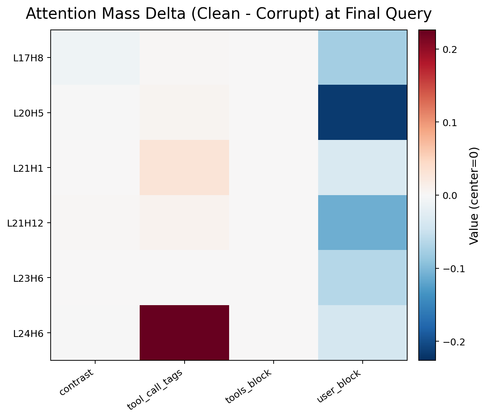

- 横轴是 4 个 `attention mass delta` 坐标，都是在“最后预测 query”上统计的注意力质量变化 `clean - corrupt`。
- `contrast`：到差异 token 位置集合的注意力质量变化。
- `tool_call_tags`：到 `<tool_call>`/`</tool_call>` 位置集合的注意力质量变化。
- `tools_block`：到 `<tools>...</tools>` 区间的注意力质量变化。
- `user_block`：到最后 user 段位置集合的注意力质量变化。
- 取值解释：`>0` 表示 clean 比 corrupt 更关注该位置集合，`<0` 表示更少关注。

- `L24H6` 在 `tool_call_tags` 上 `clean-corrupt` 注意力增量最大（约 `+0.234`）。

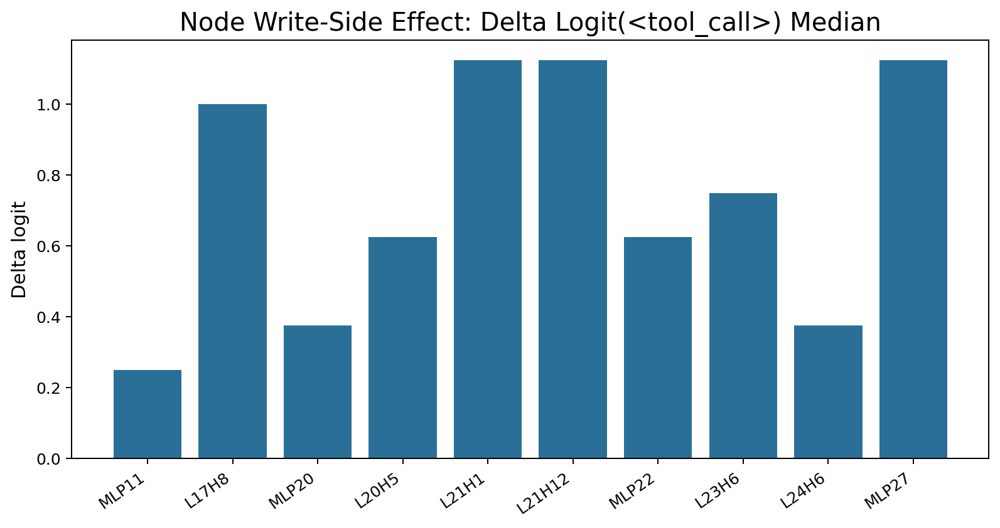

- `L21H1/L21H12/MLP27` 对 `<tool_call>` 的写侧增量最高（约 `1.125`）。

核心角色（详见 `tables/node_roles.csv`）：
- `L24H6`: Tool-Tag Reader / Distractor Suppressor
- `L20H5`: Query Reader / Distractor Suppressor
- `L17H8,L21H1,L21H12,L23H6`: Format Router 系列
- `MLP27`: Primary Writer MLP
- `MLP22`: Support Suppressor MLP

### 3.4 角色组因果验证（这里直接给 suff/nec 主结果）
**怎么做**
1. 按语义角色分组：
- `tool_tag_reader`: `L24H6`
- `query_reader`: `L20H5`
- `format_router`: `L17H8,L21H1,L21H12,L23H6`
- `primary_writer_mlp`: `MLP27`
- `support_mlp`: `MLP22`
- `aux_mlp`: `MLP11,MLP20`
2. 每个样本上做三类评估：
- 评估 A: `group alone`（只保留该组）
- 在 corrupt 上只 patch 该组 clean 激活，得 `suff_group`。
- 在 clean 上只把该组换成 corrupt 激活，得 `nec_group`。
- 含义：这组“单独拿出来”有多强（独立解释力）。
- 评估 B: `full minus group`（拿掉该组后的全电路）
- 设全核心节点集为 `C`，该组为 `G`，则评估 `C\\G` 的 suff/nec，得 `suff_minus`、`nec_minus`。
- 含义：如果只去掉这组，剩余电路还能做多少。
- 评估 C: `drop`（组内必要性）
- `drop_full_suff = suff_full - suff_minus`
- `drop_full_nec  = nec_full  - nec_minus`
- 含义：去掉该组后 full 电路损失多少；越大说明该组越“不可替代”。
3. 用 bootstrap(`n=1000`) 给中位数置信区间。

**图与结果**

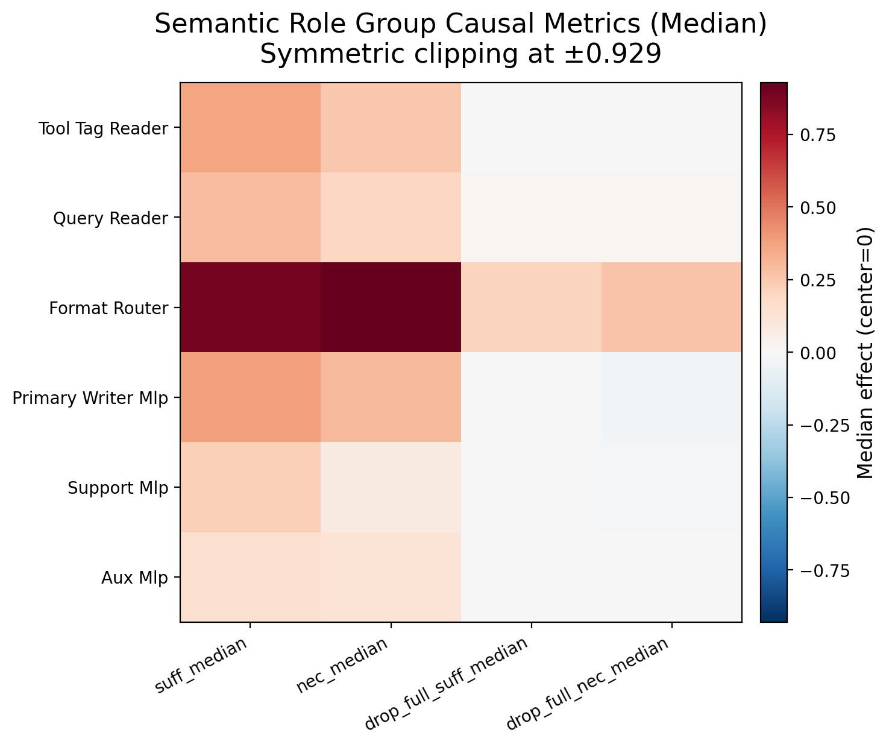

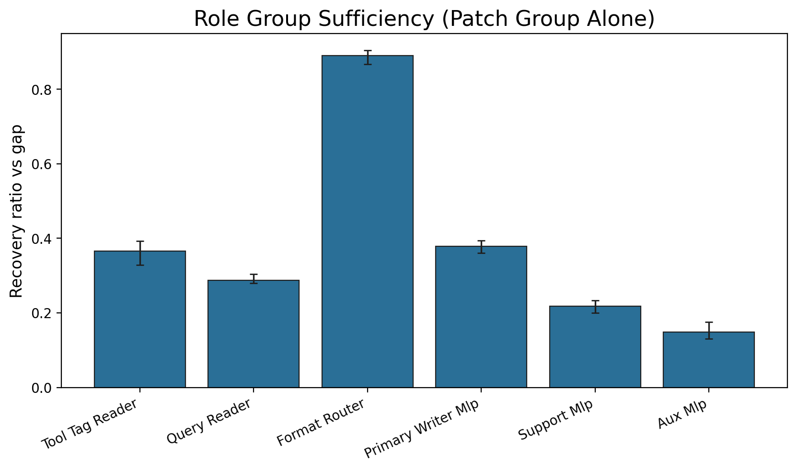

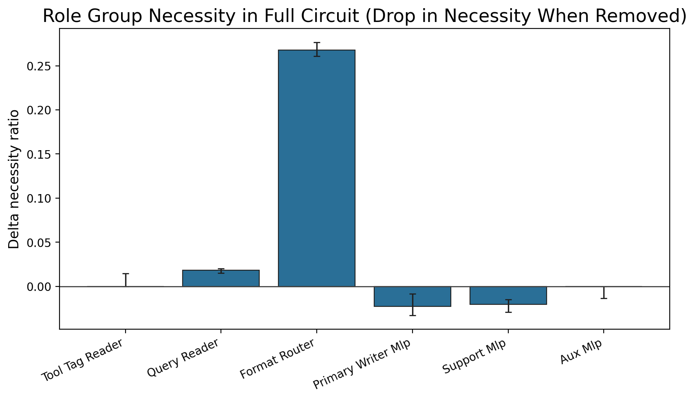

关键指标（`tables/role_group_summary.csv`）：
- `full_core (10 nodes)`
- `suff_median = 0.90698`, 95% CI `[0.89552, 0.91781]`
- `nec_median  = 0.92437`, 95% CI `[0.91176, 0.93333]`
- `format_router` 是主干必要组：
- `drop_full_suff_median = 0.20968`
- `drop_full_nec_median  = 0.26761`

关于“为什么 suff_median 比 nec_median 略低”的解释：
- 这不是致命问题，也不表示电路无效。两者衡量的是两个不同方向的干预，不要求相等，也不要求 `suff >= nec`。
- `suff` 是“从 corrupt 往上恢复”的能力，通常更保守：只 patch 核心节点无法完全重建所有上游上下文。
- `nec` 是“从 clean 往下破坏”的能力，通常更敏感：把关键节点换成 corrupt 激活会造成连锁破坏，因此可能略高于 suff。
- 本实验里两者差距很小：`0.924 - 0.907 = 0.017`（1.7 个百分点），而且 CI 有重叠区间 `[0.91176, 0.91781]`，不支持“电路无效”的结论。
- 看组合指标也很高：按样本统计 `median(min(suff,nec))≈0.898`、`median(harmonic_mean)≈0.912`，说明该电路同时具备强恢复与强必要性。

“不是单 MLP 退化”的直接证据：
- `all_heads`: `suff=0.97778`, `nec=1.05051`
- `all_mlps`: `suff=0.56522`, `nec=0.48077`

这两组数据怎么读（关键解释）：
- `all_heads` 单独就几乎复现 full 行为，说明 head 子电路本身具备接近完整的决策能力。
- `all_mlps` 单独只能恢复大约一半，说明 MLP 不是主导决策路径。
- 反过来看“移除效应”：
- 去掉 heads（只剩 MLP）对应的 `full minus all_heads` 大约就是 `all_mlps` 水平，性能大幅下降。
- 去掉 MLP（只剩 heads）对应的 `full minus all_mlps` 仍接近 `all_heads`，下降很小，甚至出现轻微负 drop（归一化后可出现），表示 heads 可替代并且部分 MLP 贡献带有冗余/干扰成分。
- 结论不是“MLP没用”，而是“MLP是协同与放大器，heads 是主干决定路径”。

### 3.5 contrast token tracing（位置层）
**怎么做**
- 在每层 `hook_resid_pre` 只 patch 单个位置向量，比较不同位置的恢复曲线：
- contrast token
- `<tool_call>` token
- prefix token

“位置向量”具体是什么意思：
- 对于层 `l` 的残差流张量 `resid_pre[l]`，形状是 `[seq_len, d_model]`（批大小省略）。
- 其中第 `p` 个位置的向量 `resid_pre[l, p, :]` 就是“位置 `p` 的位置向量”（准确说是该位置在该层的残差状态向量）。
- “只 patch 单个位置向量”就是：仅把 corrupt 的 `resid_pre[l, p, :]` 替换为 clean 的对应向量，其他位置保持 corrupt 不变。
- 这样可以隔离“这个位置在这一层携带的信息”对最终 `<tool_call>` 决策的因果作用。

**图与结果**

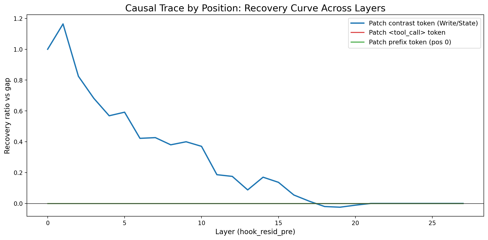

- 全 `139` 样本的 contrast 位置一致：`133`
- contrast 曲线早层峰值高（L1 约 `1.164`），随后衰减
- `<tool_call>` 与 prefix 位置曲线近零

结论：差异信号源头在早层 contrast，但 tracing 本身不告诉“经过哪条边”。

### 3.6 边级 Path Patching（路径层）
**怎么做**
对每条边 `u->v`：
1. 先明确节点类型和 patch 位点（逐边都这样做）：
- 若 `u` 或 `v` 是 head `LxHy`：操作位点是 `blocks.x.attn.hook_z[:, -1, h, :]`（最后预测位置的该头输出）。
- 若是 `MLPk`：位点是 `blocks.k.hook_mlp_out[:, -1, :]`（最后预测位置 MLP 输出）。
- 若是 `Input Embed`：位点是 `blocks.0.hook_resid_pre[:, contrast_pos, :]`（只在差异 token 位置 patch）。
2. 计算 `source_ratio`（源作用）：
- 在 corrupt 前向中，仅把 `u` 的对应位点替换为 clean 缓存，得到 `obj_source`。
- `source_ratio = (obj_source - obj_corrupt) / gap`。
3. 计算 `blocked_ratio`（阻断目标）：
- 在第 2 步基础上，再把 `v` 的对应位点强制替换回 corrupt 缓存，得到 `obj_blocked`。
- `blocked_ratio = (obj_blocked - obj_corrupt) / gap`。
- 特例：若 `v` 是 Output 节点，则 `blocked_ratio` 直接取 0 基线（等价于把“到输出的该边通路”完全阻断）。
4. 计算边中介效应：
- `edge_ratio = source_ratio - blocked_ratio`。
- 若 `edge_ratio > 0` 且跨样本稳定，表示 `u` 对目标函数的影响有一部分确实通过 `v` 这条边传递。

若 `edge_ratio` 显著为正，表示 `u` 的作用确实经 `v` 中介传播。

稳健性：按 mismatch 规则最多丢弃 `10%` 高影响样本；本次丢弃 `13/139`，同时报告 full 与 trimmed。

**图与结果**

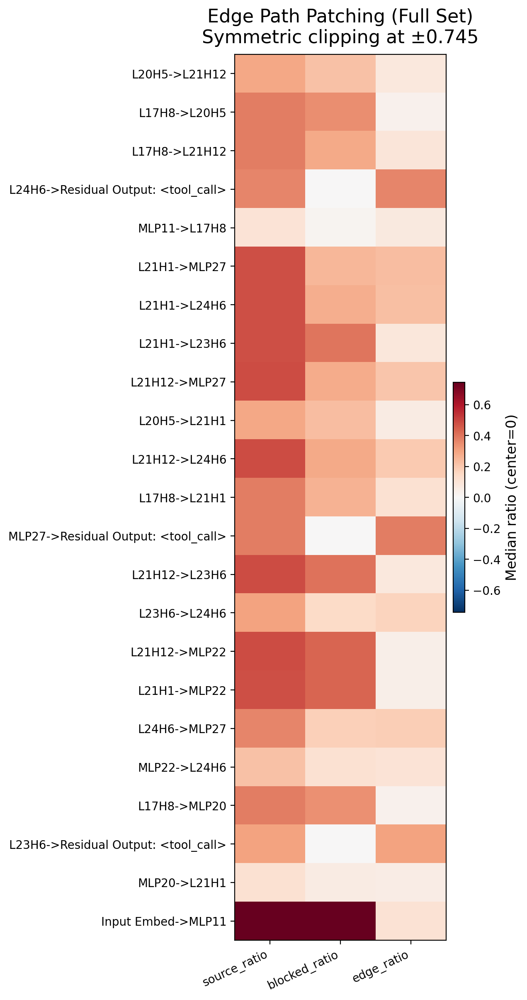

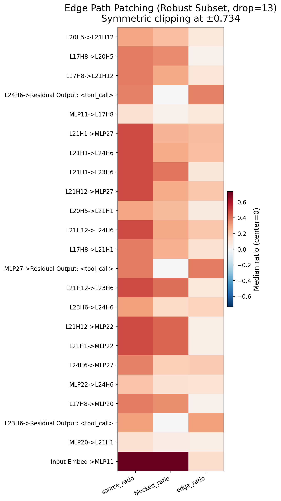


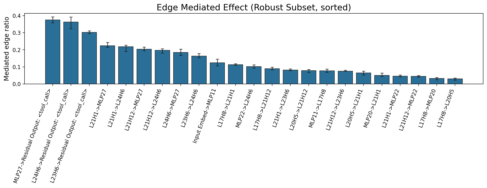

trimmed 代表性中介边（`tables/path_patch_edge_summary_trimmed.csv`）：
- `Input Embed->MLP11`: `0.124`
- `MLP11->L17H8`: `0.078`
- `L17H8->L21H1`: `0.113`
- `L20H5->L21H12`: `0.078`
- `L21H1->MLP27`: `0.224`
- `L21H12->MLP27`: `0.204`
- `L21H1->L24H6`: `0.218`
- `L21H12->L24H6`: `0.197`
- `MLP27->Output`: `0.375`
- `L24H6->Output`: `0.362`

结论：早层 contrast 信号到 L20+ 主干再到输出的“边级路径”被直接量化验证。

## 4. 最终电路（由上面每一步证据共同确定）

### 4.1 详细电路（节点级）
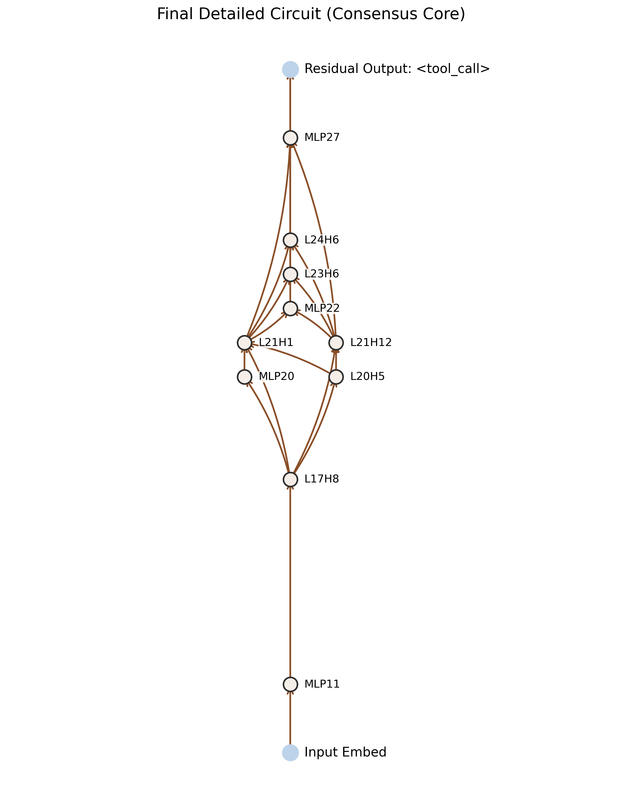

### 4.2 粗粒度电路（语义角色级）
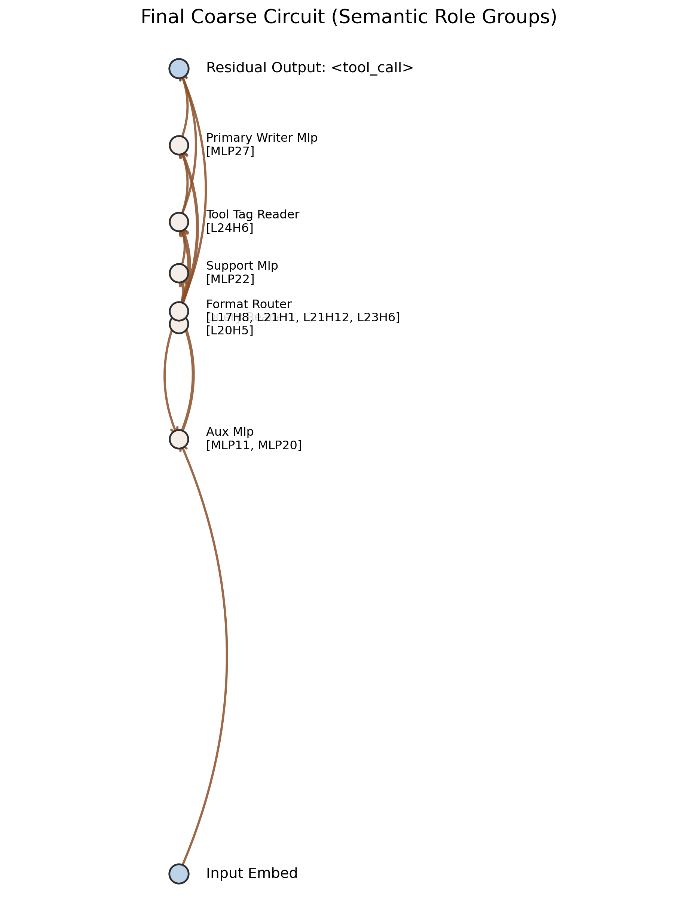

### 4.3 边级因果验证版本
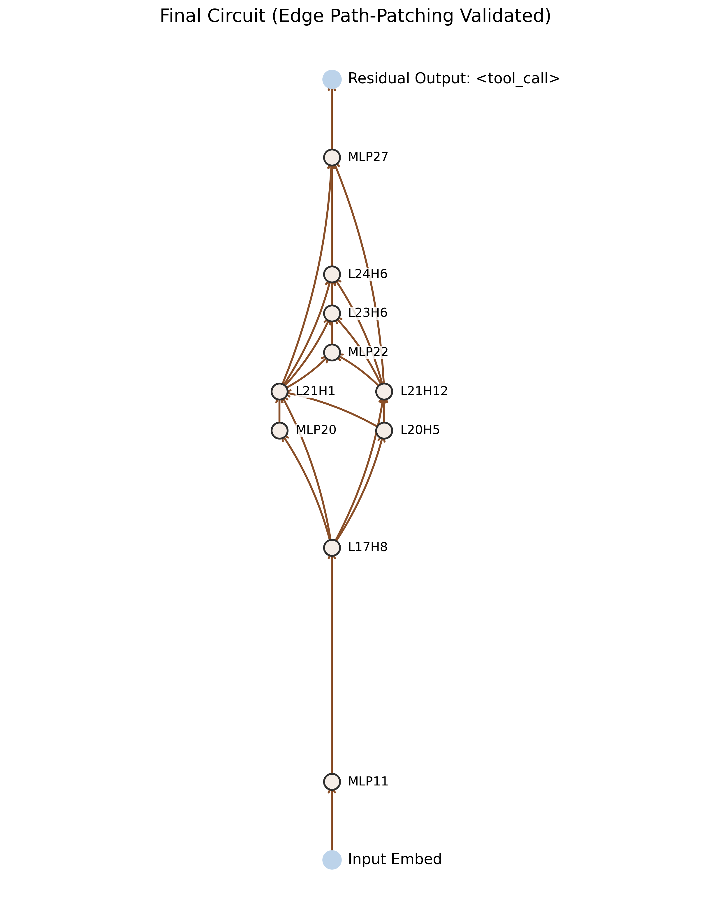

可以直接用于正文的机制链：

`Input/contrast -> MLP11 -> L17H8 -> L20H5 -> (L21H1/L21H12) -> (L24H6, MLP27) -> Output(<tool_call>)`

## 5. 复现实验命令（按顺序）

```bash
# 1) 单样本批量挖掘
python experiments/launch_toolcall_qwen3_batch.py \
  --pair-dir /root/data/XAI-1.7B-ACDC/pair \
  --model-path /root/data/Qwen/Qwen3-1.7B \
  --out-root experiments/results/toolcall_q1_q164 \
  --device cuda --q-min 1 --q-max 164

# 2) 跨样本聚合
python experiments/aggregate_toolcall_circuits.py \
  --input-root experiments/results/toolcall_q1_q164 \
  --output-root experiments/results/toolcall_q1_q164_aggregate \
  --model-path /root/data/Qwen/Qwen3-1.7B \
  --device cuda

# 3) 语义角色
python experiments/analyze_toolcall_semantic_roles.py \
  --input-root experiments/results/toolcall_q1_q164 \
  --aggregate-summary experiments/results/toolcall_q1_q164_aggregate/global_core_summary.json \
  --output-root experiments/results/toolcall_q1_q164_semantic_roles_v3 \
  --model-path /root/data/Qwen/Qwen3-1.7B --device cuda

# 4) 角色组因果
python experiments/evaluate_toolcall_role_groups.py \
  --input-root experiments/results/toolcall_q1_q164 \
  --semantic-report experiments/results/toolcall_q1_q164_semantic_roles_v3/semantic_roles_report.json \
  --output-root experiments/results/toolcall_q1_q164_semantic_roles_v3 \
  --model-path /root/data/Qwen/Qwen3-1.7B --device cuda

# 5) contrast tracing
python experiments/trace_toolcall_contrast_token.py \
  --input-root experiments/results/toolcall_q1_q164 \
  --output-root experiments/results/toolcall_q1_q164_semantic_roles_v3 \
  --model-path /root/data/Qwen/Qwen3-1.7B --device cuda

# 6) 边级 path patching
python experiments/path_patch_toolcall_edges.py \
  --input-root experiments/results/toolcall_q1_q164 \
  --aggregate-summary experiments/results/toolcall_q1_q164_aggregate/global_core_summary.json \
  --output-root experiments/results/toolcall_q1_q164_semantic_roles_v3 \
  --model-path /root/data/Qwen/Qwen3-1.7B --device cuda --trim-frac 0.10
```

## 6. 本目录文件索引

### 6.1 图（`figures/`）
- `final_circuit.png`
- `final_circuit_coarse.png`
- `final_circuit_edge_path_patching.png`
- `semantic_read_causal_heatmap.png`
- `semantic_attention_delta_heatmap.png`
- `semantic_write_target_delta.png`
- `role_group_causal_heatmap.png`
- `role_group_sufficiency.png`
- `role_group_necessity_drop.png`
- `contrast_token_trace.png`
- `path_patch_edge_heatmap_full.png`
- `path_patch_edge_heatmap_trimmed.png`
- `path_patch_edge_bar_full.png`
- `path_patch_edge_bar_trimmed.png`

### 6.2 表（`tables/`）
- `node_roles.csv`
- `role_group_summary.csv`
- `path_patch_edge_summary_full.csv`
- `path_patch_edge_summary_trimmed.csv`
- `semantic_node_metrics.csv`

### 6.3 报告（`reports/`）
- `semantic_roles_report.json`
- `role_group_report.json`
- `contrast_token_trace_report.json`
- `path_patch_edge_report.json`

### 6.4 聚合上下文（`context/`）
- `global_core_summary.json`
- `final_circuit_global_core.png`

### 6.5 明细补全（2026-03-10，`final/` 同步增强）
- 图（`figures/`）：
  - `final_circuit_semantic.png`
  - `shift_robustness_useraware_v1_nec_heatmap.png`
  - `shift_robustness_useraware_v1_suff_heatmap.png`
  - `shift_robustness_systemaware_v1_nec_heatmap.png`
  - `shift_robustness_systemaware_v1_suff_heatmap.png`
- 表（`tables/`）：
  - `path_patch_edge_per_sample.csv`
  - `role_group_per_sample.csv`
  - `node_ablation_per_sample.csv`
  - `node_ablation_gap08_per_sample.csv`
  - `node_ablation_user_json_per_sample.csv`
  - `node_ablation_system_json_per_sample.csv`
  - `shift_robustness_useraware_v1_per_sample.csv`
  - `shift_robustness_systemaware_v1_per_sample.csv`
- 报告（`reports/`）：
  - `proposed_groups_data_driven.json`

## 7. 一句话结论
当前结果已经形成“跨样本一致 + 节点语义 + 组级因果 + 边级中介”的完整证据链，最终是 `L20/L21/L24` 头主干与 `MLP27` 写侧协同决定 `<tool_call>`，而不是单 MLP 退化。
